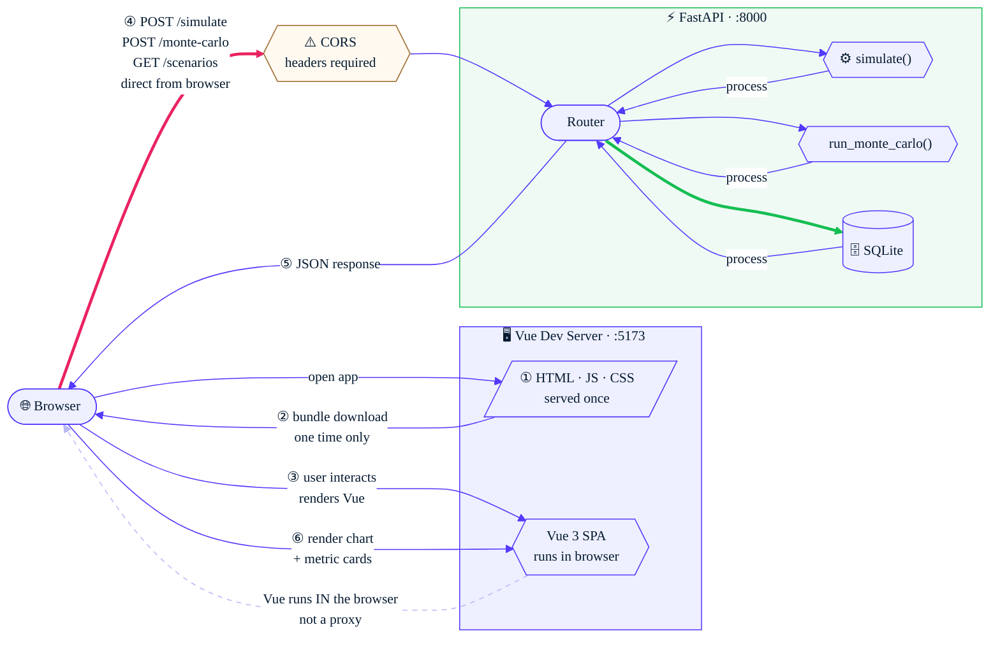
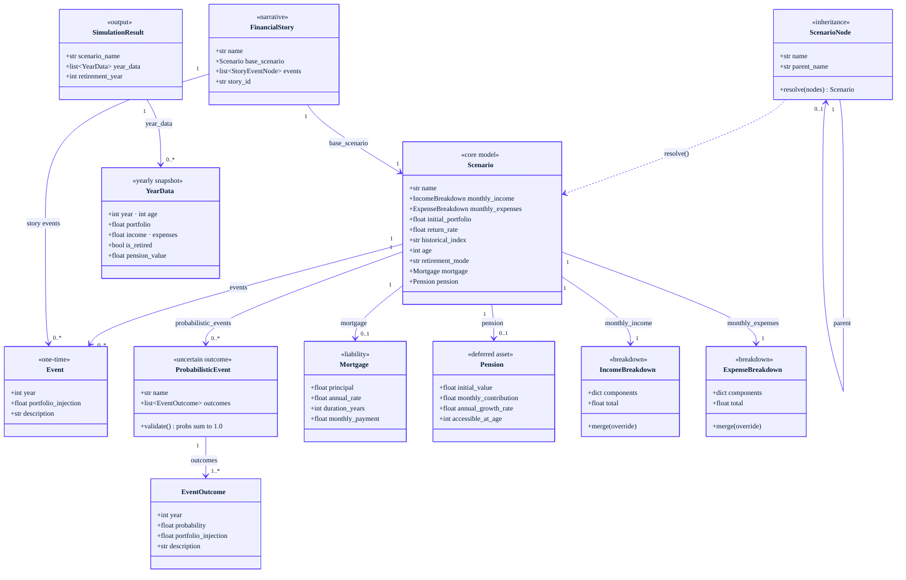
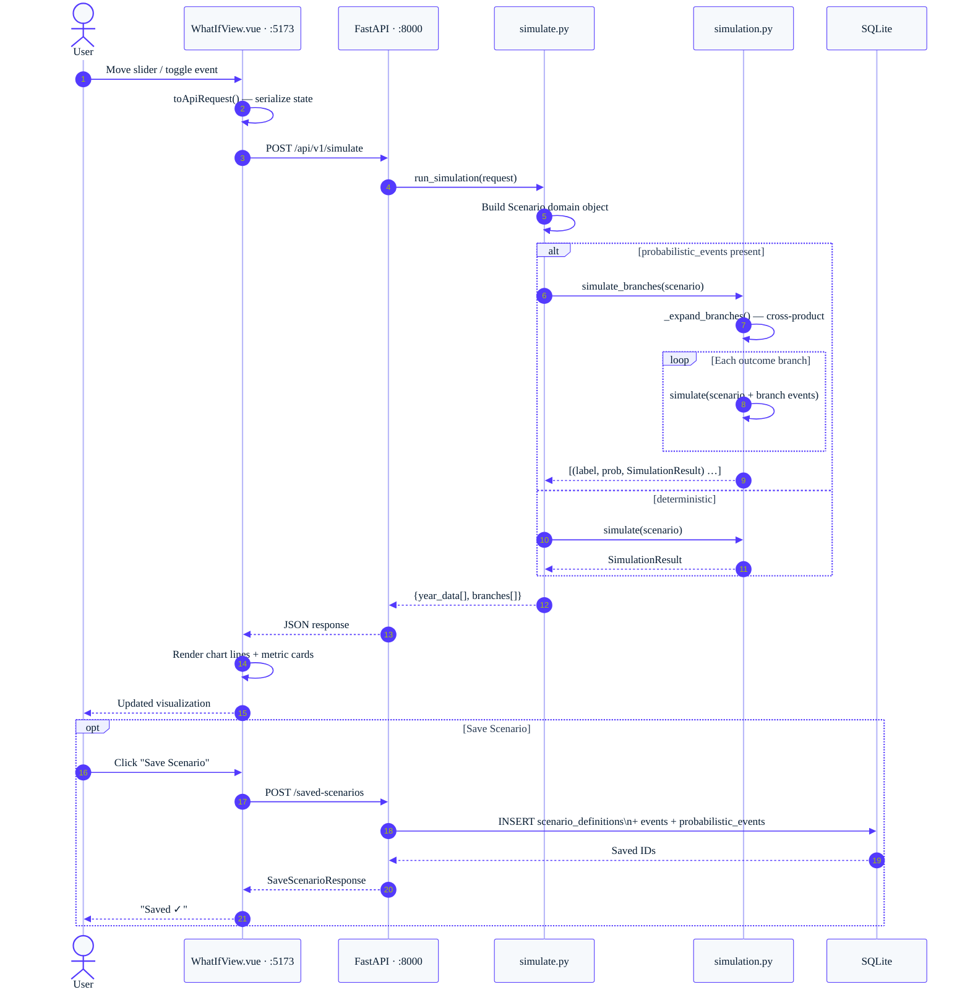
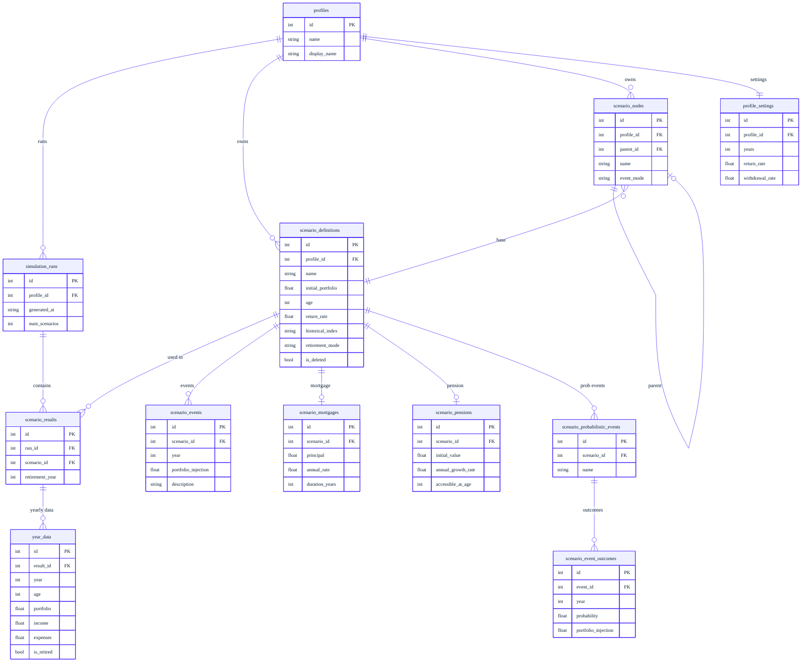
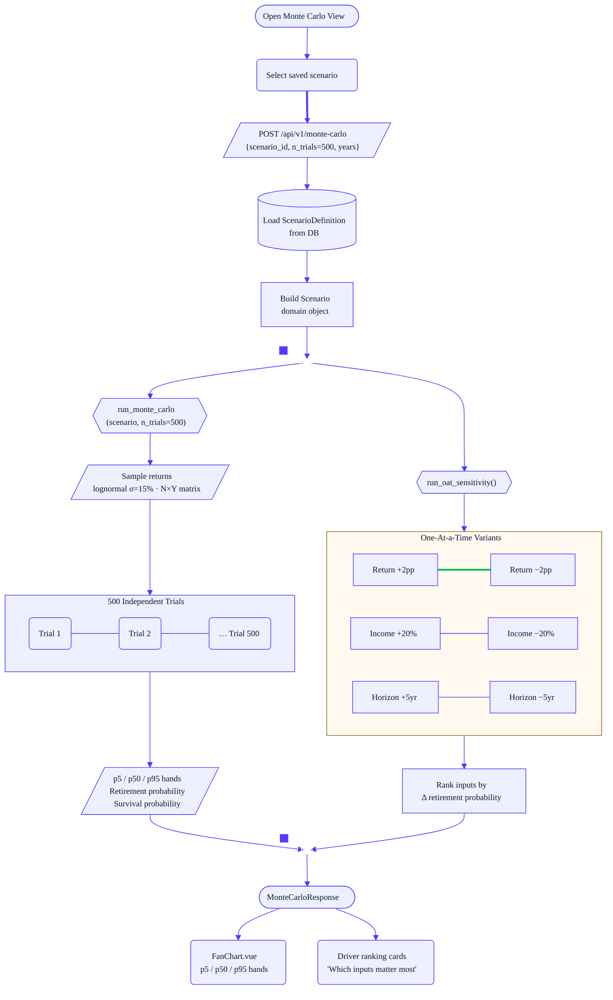
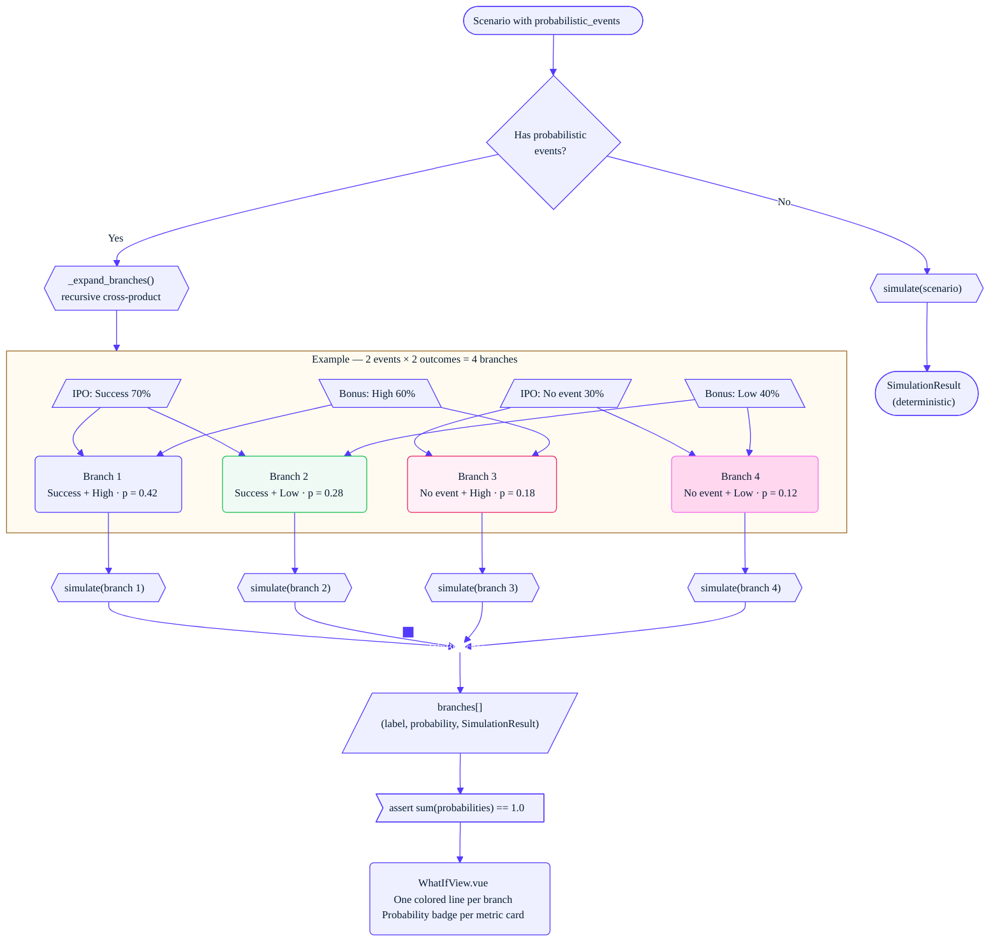

# Finance Planner — System Design Diagrams

A personal financial independence planner that simulates portfolio growth over time, models uncertain life events (IPO exits, bonuses, property purchases), and calculates the earliest year you can retire. Built with a pure-Python domain engine, a FastAPI backend, and a Vue 3 frontend. Supports deterministic simulation, probabilistic branching, and 500-trial Monte Carlo analysis across real historical index returns (S&P 500, NASDAQ, Bonds, Russell 2000).

Seven Mermaid diagrams covering architecture, data models, request flows, and simulation logic.

---

## Diagram 0: Client ↔ Two Servers

---

## Diagram 1: Layer Architecture & Dependencies

```mermaid
%%{init: {
  "theme": "base",
  "themeVariables": {
    "background": "#ffffff",
    "primaryColor": "#f0f4ff",
    "primaryTextColor": "#061b31",
    "primaryBorderColor": "#b9b9f9",
    "lineColor": "#533afd",
    "secondaryColor": "#f6f9fc",
    "tertiaryColor": "#ffd7ef",
    "edgeLabelBackground": "#ffffff",
    "clusterBkg": "#f6f9fc",
    "clusterBorder": "#e5edf5",
    "titleColor": "#061b31",
    "fontFamily": "ui-monospace, monospace",
    "fontSize": "13px"
  }
}}%%
graph TD
    subgraph FE["🖥️  Frontend  ·  Vue 3  · :5173"]
        WhatIfView("What-If Explorer\nSliders · Events · Probabilistic")
        ScenarioDetailView("Scenario Detail")
        MonteCarloView("Monte Carlo View")
        ScenariosView("Saved Scenarios")
    end

    subgraph BE["⚡  Backend  ·  FastAPI  :8000"]
        simulate[/"POST /simulate"/]
        montecarlo[/"POST /monte-carlo"/]
        saves[/"POST /saved-scenarios"/]
        scenarios[/"GET /scenarios"/]
        generator[/"POST /generate-scenario"/]
    end

    subgraph Domain["🧠  Domain  ·  Pure Python"]
        simulation{{"simulation.py\nsimulate() · simulate_branches()"}}
        monte_carlo{{"monte_carlo.py\nrun_monte_carlo()"}}
        sensitivity{{"sensitivity.py\nrun_oat_sensitivity()"}}
        models["models.py\nScenario · Event · ProbabilisticEvent\nMortgage · Pension · FinancialStory"]
        historical["historical_returns.py\nS&P500 · NASDAQ · Bonds · Russell2000"]
    end

    subgraph Infra["🔧  Infrastructure"]
        loaders(["loaders.py — load_scenarios()"])
        parsers(["parsers.py — dict → model"])
        cache(["cache.py — SimulationCache"])
        data_layer(["data_layer.py — ProfileManager"])
    end

    subgraph DB["🗄️  SQLite"]
        profiles_t[(profiles)]
        scenario_defs[(scenario_definitions)]
        sim_runs[(simulation_runs + year_data)]
        prob_events[(probabilistic_events + outcomes)]
    end

    FE -->|"HTTP / JSON  :5173 → :8000"| BE
    BE --> Domain
    BE --> DB
    Domain --> Infra
    Infra --> DB

    style FE fill:#eef0ff,stroke:#533afd,color:#061b31
    style BE fill:#f0faf4,stroke:#15be53,color:#061b31
    style Domain fill:#fff9f0,stroke:#9b6829,color:#061b31
    style Infra fill:#fff0f7,stroke:#ea2261,color:#061b31
    style DB fill:#f6f9fc,stroke:#64748d,color:#061b31
```

---

## Diagram 2: Domain Model Relationships

---

## Diagram 3: What-If Simulation — Request Flow

---

## Diagram 4: Database Schema

---

## Diagram 5: Monte Carlo & Sensitivity Analysis

---

## Diagram 6: Probabilistic Events — Branch Simulation

